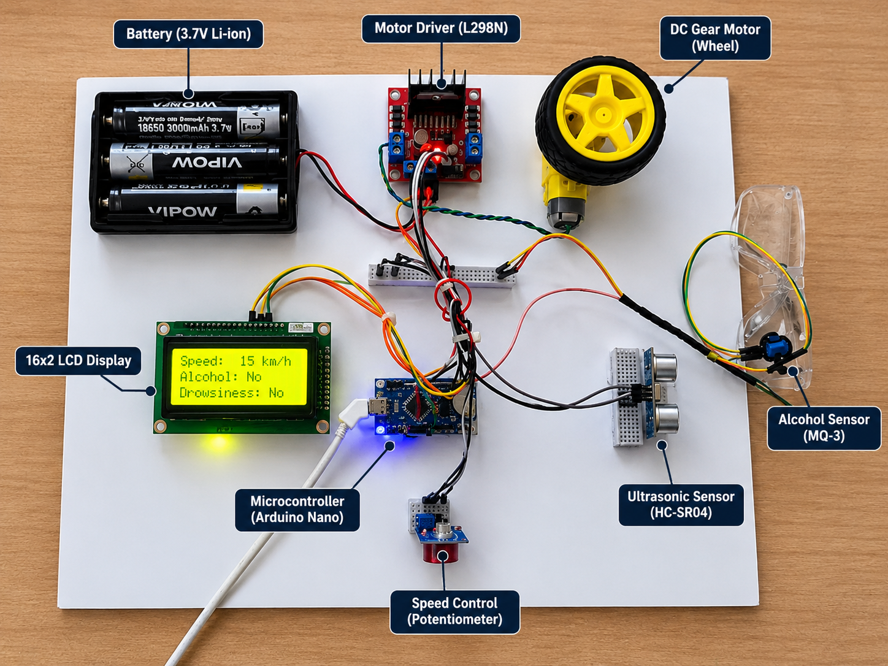
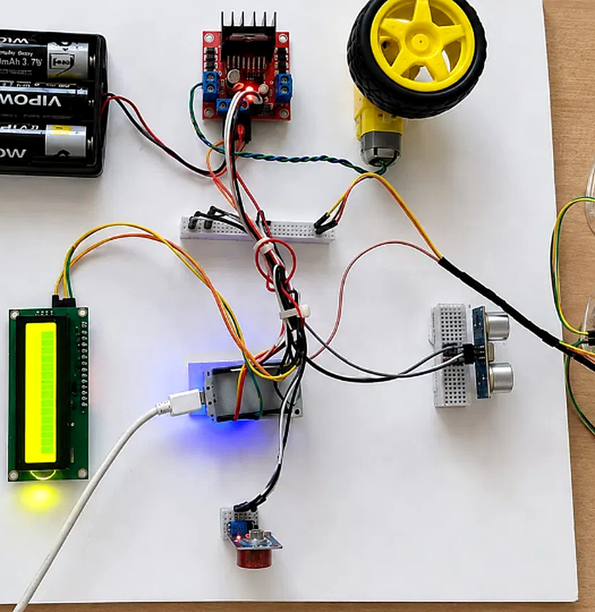
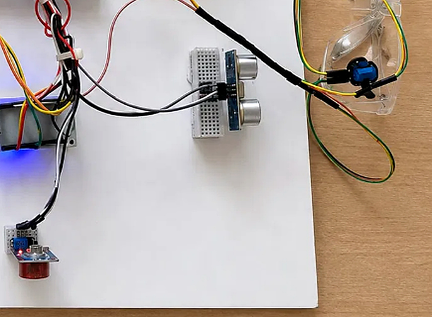
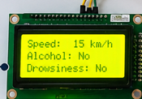

# 🚗 AI-Based Driver Drowsiness Detection and Automatic Speed Control System with Alcohol Monitoring

> An IoT-based driver safety system designed to detect driver drowsiness, monitor alcohol presence, detect obstacles, and automatically control vehicle speed using **NodeMCU ESP8266**.

---

## 🌐 Local Demo

The project includes a local web interface for demonstration.

**Local Demo:** `http://10.51.227.152/`

> ⚠️ This is a **local/private network IP address**. It will work only when the system and accessing device are connected to the same network. It is not a public website.

---

## 📌 Project Overview

Driver fatigue and alcohol consumption are major safety concerns in road transportation. This project combines multiple sensing technologies with IoT-based control to improve driver and vehicle safety.

The system continuously monitors the driver's eye condition and alcohol presence while also detecting obstacles in front of the vehicle. Based on the detected conditions, the system can automatically control the vehicle speed.

The project is developed using **NodeMCU ESP8266** as the main controller and integrates sensors, motor control, LCD display, and a DC geared motor.

---

## 🎯 Objectives

* Detect driver drowsiness using an **IR Eye Blink Sensor**.
* Monitor alcohol presence using an **MQ-3 Alcohol Sensor**.
* Detect obstacles using an **HC-SR04 Ultrasonic Sensor**.
* Automatically control vehicle speed using an **L298N Motor Driver Module**.
* Display system information using a **16×2 LCD Display**.
* Improve driver and vehicle safety through automated monitoring and control.
* Demonstrate an IoT-enabled embedded safety system.

---

## ✨ Key Features

* 👁️ **Drowsiness Detection**
* 🍺 **Alcohol Monitoring**
* 🚧 **Obstacle Detection**
* ⚙️ **Automatic Speed Control**
* 📟 **LCD Status Display**
* 🌐 **IoT / Local Web Monitoring**
* 🔋 **Battery Powered Prototype**
* 🚗 **Motor-Based Vehicle Prototype**

---

## 🛠️ Hardware Components

| S.No | Component                      |
| ---- | ------------------------------ |
| 1    | NodeMCU ESP8266                |
| 2    | L298N Motor Driver Module      |
| 3    | DC Geared Motor with Wheel     |
| 4    | 18650 Lithium-Ion Battery Pack |
| 5    | 16×2 LCD Display               |
| 6    | HC-SR04 Ultrasonic Sensor      |
| 7    | MQ-3 Alcohol Sensor            |
| 8    | IR Eye Blink Sensor            |
| 9    | Breadboard                     |
| 10   | Jumper Wires                   |
| 11   | USB Power Cable                |
| 12   | Safety Goggles                 |

---

## 💻 Technologies Used

* **Embedded Systems**
* **IoT**
* **NodeMCU ESP8266**
* **Embedded C / Arduino-compatible programming**
* **Sensor Interfacing**
* **Motor Control**
* **LCD Interfacing**
* **Web-based Local Monitoring**

---

## ⚙️ System Working

### 1. Driver Drowsiness Detection

The **IR Eye Blink Sensor** is used to monitor the driver's eye condition. When prolonged eye closure is detected, the system identifies a possible drowsiness condition.

### 2. Alcohol Monitoring

The **MQ-3 Alcohol Sensor** detects the presence of alcohol around the driver. When the detected level crosses the configured threshold, the system identifies an alcohol-related safety condition.

### 3. Obstacle Detection

The **HC-SR04 Ultrasonic Sensor** measures the distance between the vehicle and nearby obstacles.

### 4. Automatic Speed Control

The **NodeMCU ESP8266** processes the sensor information and controls the **L298N Motor Driver Module**. Depending on the detected safety conditions, the motor speed can be controlled automatically.

### 5. LCD Display

The **16×2 LCD Display** provides system information and sensor-related status to the user.

---

## 🔄 System Workflow

```text
              START
                │
                ▼
       Initialize System
                │
                ▼
        Read Eye Sensor
                │
        ┌───────┴───────┐
        │               │
   Drowsiness?          No
        │               │
       Yes              │
        │               │
        ▼               │
   Safety Condition     │
        │               │
        └───────┬───────┘
                ▼
        Read MQ-3 Sensor
                │
        ┌───────┴───────┐
        │               │
   Alcohol Detected?    No
        │               │
       Yes              │
        │               │
        ▼               │
   Safety Condition     │
        │               │
        └───────┬───────┘
                ▼
       Read Ultrasonic
          Distance
                │
                ▼
       Control Motor Speed
                │
                ▼
        Update LCD Status
                │
                ▼
          Repeat Cycle
```

---

## 🧩 System Architecture

The overall system consists of four major sections:

```text
┌───────────────────────────────┐
│          INPUT SENSORS        │
│                               │
│  IR Eye Blink Sensor          │
│  MQ-3 Alcohol Sensor          │
│  HC-SR04 Ultrasonic Sensor    │
└───────────────┬───────────────┘
                │
                ▼
┌───────────────────────────────┐
│       NODEMCU ESP8266         │
│      Main Control Unit        │
└───────────────┬───────────────┘
                │
       ┌────────┴─────────┐
       │                  │
       ▼                  ▼
┌───────────────┐  ┌────────────────┐
│  16×2 LCD     │  │ L298N Motor    │
│   Display     │  │ Driver Module  │
└───────────────┘  └───────┬────────┘
                           │
                           ▼
                   DC Geared Motor
```

---

## 📷 Project Prototype



### Additional Prototype Views







---

## 📊 Project Documentation

The project documentation contains the detailed explanation, circuit design, system architecture, implementation details, and project results.

📄 **[View Project Report](report/AI-Driver-Drowsiness-Speed-Control-Project-Report.pdf)**

### Project Diagrams

* 📐 [Block Diagram](docs/block-diagram.png)
* 🔌 [Circuit Diagram](docs/circuit-diagram.png)
* 🔄 [Flowchart](docs/flowchart.png)

---

## 📁 Project Structure

```text
AI-Driver-Drowsiness-Speed-Control/
│
├── README.md
│
├── src/
│   └── driver_drowsiness_speed_control.ino
│
├── docs/
│   ├── block-diagram.png
│   ├── circuit-diagram.png
│   └── flowchart.png
│
├── images/
│   ├── lcd-display.jpg.png
│   ├── project-setup.jpg
│   ├── prototype.jpg.png
│   └── sensor-setup.jpg
│
└── report/
    └── AI-Driver-Drowsiness-Speed-Control-Project-Report.pdf
```

---

## 🚀 Getting S
